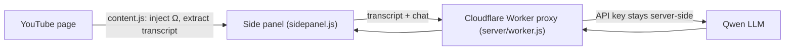

# Echo · 回声

> "Not a summary, but an echo."

**Echo** is a Chrome extension that gives YouTube videos a voice worth arguing with. Instead of a flat AI summary, it reads the transcript, picks a relevant thinker who would see the topic differently from the speaker, and lets you talk with that persona in the side panel.

## What it does

- **Ω button.** A subtle button appears next to the video title. Click it to open the side panel.
- **Persona selection.** Echo analyzes the transcript and summons a fitting expert or thinker to comment. It identifies the speaker first so the commentator is a *different* perspective, not an echo of the speaker.
- **First-person dialogue.** The persona answers in character and can reference specific parts of the transcript.
- **Dark, cinematic UI** with amber accents.

## How it works

The API key never ships with the extension. The extension talks only to a small proxy you control.

## Install (beta, not yet on the Chrome Web Store)

1. Click **Code → Download ZIP** on this page and unzip it.
2. Open `chrome://extensions/` and turn on **Developer mode**.
3. Click **Load unpacked** and select the unzipped folder.
4. Open any YouTube video and click the **Ω** button near the title.

## Run your own backend (optional)

The extension points at a default proxy. To use your own API key, deploy `server/worker.js` to Cloudflare Workers and set your Worker URL in the extension's options page. See [DEPLOY.md](DEPLOY.md).

## Project layout

| File | Role |
| --- | --- |
| `manifest.json` | MV3 extension config |
| `content.js`, `content.css` | Injects the Ω button, extracts the transcript |
| `sidepanel.html`, `sidepanel.js` | Chat UI and persona logic |
| `background.js` | Service worker that manages the side panel |
| `options.html` | Custom proxy URL setting |
| `server/worker.js` | Cloudflare Worker proxy to the model |
| `docs/privacy-policy.html` | Privacy policy |

## Privacy

Only the video transcript and your chat messages are sent to the proxy for a response. Nothing is stored server-side. See the [privacy policy](docs/privacy-policy.html).

## License

MIT
